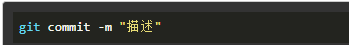

# Github的使用

## 登录

- 首先进入github官网，https://github.com/，进行账号注册。

## 创建仓库

- 登陆github账号，点击在右上角头像或标识旁边，单击 然后选择”New repository” 新建存储库。

- reponsitoy name 命名存储库的名称。description写一个简短的描述、说明。选择是私人private可看并提交该库，或者任何都可以看到，由自己选择谁可以提交该库。
  选择使用README初始化此存储库。点击Creare repository创建完成。

## 提交代码

- 安装git客户端

  - 官方下载地址：http://git-scm.com/download/  根据自己的系统下载对应版本。然后一直默认安装

- 配置git

  - 安装完成，在开始菜单中找到git文件夹，点击“git bash”，弹出如下界面

    

  - 填写一下用户名和邮箱用作标识

  

  

  - 本地的git仓库和GitHub之间是通过SSH或HTTPS连接的，这里采用SSH方式。创建SSH密钥，在用户主目录下，查看是否存在.ssh文件，如果存在再看文件下有没有id_rsa和id_rsa.pub这两个文件，如果都存在，可直接到下一步。如果没有，单击右键然后选择【Git Bash Here】创建SSH Key。

  

  - 使用命令ssh-keygen -t rsa -C “注册github的邮箱”创建，然后一路回车

  

  

  - 创建完成后可以看到用户目录下生成了【.ssh】文件夹，里面有公钥和私钥文件

  

  - 在GitHub上设置密钥，选择用户下来菜单【Settings】-【SSH and GPG keys】-【New SSH key】

  

  - 将本地生成的公钥id_rsa.pub文件内容复制过来

  

  - 测试是否能够成功连接，在git bush界面输入 ssh -T git@github.com，看到【Hi xxx! You've successfully authenticated, but GitHub does not provide shell access.】就证明密钥设置成功，同时【.ssh】文件夹下会多出一个【known_hosts】文件。
  
    

- 关联远程仓库和本地仓库

  - 在github复制仓库地址url，在本地项目所在文件夹鼠标右键单击运行【Git Bash Here】，然后运行如下命令：git remote add origin 复制的仓库地址URL

  

  

  【注意】：如果这里碰到错误【fatal: not a git repository (or any of the parent directories): .git】，这是因为在当前目录下找不到【.git】文件夹，只需要运行命令【git init】即可解决

  

  - 提交本地仓库内容到远程仓库，连接到远程仓库后运行命令：git push -u origin master，这是第一次推送master分支的所有内容命令，弹出输入用户名和密码的页面，直接输入即可。以后每次本地提交可以使用命令：git push origin master。

    

  - 如果工程目录下存在已有文件夹也需要提交，在运行push命令前需要使用命令【git add .】添加当前目录下所有文件。

  

  ​		然后使用命令【git commit -m “描述”】将【git add .】存入暂存区的修改内容提交至本地仓库中，若文件未添加至暂存区，则提交时不会提交任何修改。

  

  ​		最后再运行push命令提交到远程仓库，然后在GitHub上就可以看到刚刚上传的文件。

  

  ​	【注意】：如果这里碰到错误【error: src refspec master does not match any.】，这是因为本地仓库和远程仓库的内容不一致造成的，只需要使用命令【git pull --rebase origin master】把远程仓库的内容同步到本地仓库就可以解决

  。

  

  

  ​	将远程仓库的内容同步到本地仓库之后，再次提交内容。

  

## 往别人的代码仓库中提交

- 先到别人的github上点击”fork“到自己的github，然后在从自己的github克隆项目，修改后上传到自己的github，之后点Create pull request就传到别人的github上。

  - 在所要修改的github上点击 “fork” 传入到自己的github

  - 打开git，首先建立仓库，并从自己的github地址克隆项目到本地。

     复制github项目地址

  

  ​      	使用命令【git init】创建本地仓库，然后使用命令【git clone 复制的项目地址 】克隆到本地

  

  

  - 将修改之后的项目上传到自己github里，输入命令【 git add .】 对修改内容进行同步，再输入命令【git status】查看进度，然后使用命令【git commit -m “注释内容”】，主要作用是对修改的地方进行注释，方便别人查看。然后【git push】上传即可

  

  - 点击github上面的“pull request”，再点击 "Create pull request"即可完成

    

    

    

    

    

    

    
